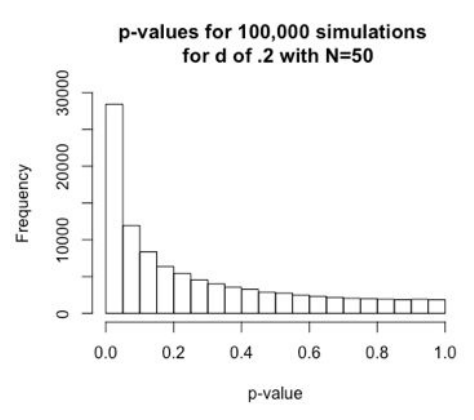

# 在开始之前 {.unnumbered}

## 开放研究和可重复性 {.unnumbered}

在本节课中，我们将介绍开放研究的关键概念，并讨论心理、生物医学和生命科学领域所谓的"复制危机"，它导致了开放研究运动，我们还将讨论在您自己的研究中采用可重复的研究实践的重要性，并介绍可以将其纳入自己的研究工作流程中的各种工具和流程，以便您进行可重复的研究。

### 开放研究 {.unnumbered}

大家可以观看下面的视频了解[开放研究的简史](https://www.youtube.com/watch?v=nfHOnuo1T2o) （Youtube视频）和对应[幻灯片](https://docs.google.com/presentation/d/1UOkWayJ5J7j2Xg1Y05sbkK-iWtlkAVvtalOu4VuEq4c/edit#slide=id.g875f6a825d_0_346)（存储在谷歌云盘服务上），也可直接阅读下方由[AI生成的总结](https://glarity.app/zh-CN)。

> 视频内容主要讲述了心理学和生物医学科学领域中所谓的"复制危机"，以及研究领域随着这一危机的出现而发生的变化。文章指出，许多研究结果在复制实验中无法得到验证，甚至存在虚假阳性的情况。这是因为研究者在进行研究时存在一些问题，比如选择性地报告数据、删除异常值、进行多次统计分析等，这些行为被称为"p-hacking"。为了解决这些问题，一些组织和机构开始致力于推动开放研究和透明度，改变学术奖励制度，提供培训，教授研究者如何进行更好的研究。此外，还提到了一些解决这一问题的方法，如增加实验的样本量、改变学术奖励机制、加强对开放研究和透明度的教育培训等。

> ### Highlights
>
> -   💡 "复制危机"：心理学和生物医学科学领域存在许多研究结果无法复制的问题。
> -   💡 "p-hacking"：研究者存在选择性报告数据、删除异常值、进行多次统计分析等行为，导致虚假阳性结果。
> -   💡 开放研究和透明度：一些组织和机构致力于推动开放研究和透明度，改善研究质量。
> -   💡 学术奖励机制：需要改变学术奖励机制，从数量导向转向质量导向。
> -   💡 培训和教育：研究者需要接受培训和教育，学习开放研究和透明度的实践方法。

同时，我们还推荐阅读由[Ionnidis（2005）撰写的论文](https://journals.plos.org/plosmedicine/article?id=10.1371/journal.pmed.0020124)（可选），该论文可以说开启了围绕可重复性的对话，并在过去几年中对心理学和整个生物医学科学研究产生了深刻的影响。同样的，在2019年[Dorothy Bishop的文章](https://www.nature.com/articles/d41586-019-01307-2)准确的捕获了几年后发生的情况。

## 如何进行可重复的研究 {.unnumbered}

习惯了**旧的**研究方式的研究人员面临的最大挑战之一是他们认为自己不具备采用开放和可重复的研究实践的知识或技术技能。但这并不难！在运行实验之前，您可以预先注册您的假设，以便在分析和编写结果时，可以证明您的预测确实是在数据收集之前做出的。您还可以将您的研究数据与您的代码一起开放（并且公平），以便其他人可以重新创建您的分析。并通过在预印本服务器（例如 [PsyArXiv](https://psyarxiv.com/) 或 [bioRxiv](https://www.biorxiv.org/)或[OSF](https://osf.io/)）上发布您的研究文章）在提交给期刊之前，您将研究结果向所有人公开。采用**R** 等开源软件还意味着您产生的任何研究成果都可以由能够访问您的数据和代码的其他人重新产生。使用开放工具使我们能够生成开放（且可重用）数据和代码的原则是课程背后的基本理念。观看下面的[视频](https://www.youtube.com/watch?v=BscWSJFmsHE)（Youtube平台）和对应[幻灯片](https://docs.google.com/presentation/d/1WzSk2Ra-OLrMCPTCoQoKoF_utsq_TNu53TxoXEC82Lw/edit#slide=id.p)（存储在谷歌云盘服务上）或者下面由[AI生成的总结](https://glarity.app/zh-CN)。在视频中讨论了如何采用开放且可重复的研究实践。

> 在这个演讲中，介绍了一些你可以在自己的工作流程中采用的研究实践，这将最终使你的研究更加开放和可复制。研究领域的快速变化突显了软件和计算基础设施的广泛采用，这些都是研究人员将其研究变得更加开放和可复制的方式。政治家们也对此表示关注，一些大学也高度参与开放研究实践。许多资助机构现在要求研究人员在获得资助时采用开放研究实践。开放研究不仅仅是指开放数据和代码，还包括预注册研究假设、建立可复制的数据处理和分析流程、使用开放科学方法等。采用开放和可复制的研究实践不仅使研究结果更具可信度，还有助于促进大规模合作和提高研究人员的效率。

> ### Highlights
>
> -   💡 研究领域的快速变化突显了软件和计算基础设施的广泛采用，以使研究更加开放和可复制。
> -   💡 政治家们也对开放研究实践表示关注，一些大学也高度参与其中。
> -   💡 许多资助机构要求研究人员在获得资助时采用开放研究实践。
> -   💡 开放研究不仅仅是指开放数据和代码，还包括预注册研究假设、建立可复制的数据处理和分析流程、使用开放科学方法等。
> -   💡 采用开放和可复制的研究实践不仅使研究结果更具可信度，还有助于促进大规模合作和提高研究人员的效率。

### 如果你需要一些指南 {.unnumbered}

可以阅读这一篇论文，[Crüwell et al. (2019)](https://psycnet.apa.org/fulltext/2019-80290-002.pdf)介绍了可以采取哪些措施来使您自己的研究更加开放。

对于心理学而言，[Gerald Haeffel](https://royalsocietypublishing.org/doi/10.1098/rsos.220099)提到了心理学需要更多地关注理论发展（并鼓励发表反驳理论的结果）。

## 研究功效（Experimental Power） {.unnumbered}

在这一部分我们将讨论研究的功效（Power），以及为什么它而很重要。"可重复性危机（replication crisis）"揭示的一个观点是，研究往往对感兴趣的效应大小缺乏足够的统计功效（也就是说,即使效应存在,你的实验也不太可能找到它）。很多问题都源于研究人员没有花足够时间考虑他们研究设计的统计功效问题。即使统计功效不足的研究确实发现了感兴趣的效应,效应大小本身也会被高估(从而为未来基于这一错误效应大小估计进行功效计算的工作带来问题)。

一个解决方案是在实验设计过程中进行数据模拟。使用R有许多方法可以做到这一点,CRAN(the Comprehensive R Archive Network)上有几个包提供了用于不同设计的数据模拟功能。

### 介绍 {.unnumbered}

#### 理解统计 {.unnumbered}

假设有一个检验，有95%的概率可以正确诊断出一个人没有患有某种疾病。 （特异性= 0.95）。同时，这个检验还拥有80%的准确率，可以正确诊断出某人患有某种疾病（敏感性=0.8）。最后，这种疾病的实际患病率为1%。

现在看来这种检验如何？95%的准确率可以诊断出一个人没有患病，80%的准确率可以诊断出一个人患有某种疾病。看起来还不错？让我们继续看下去。

在10000个人中，当患病率为1%时。有100个人患有某种疾病。由于检验的敏感性为0.8，在100名患者中，80%被检测出来了（80人真阳性），20%没有被检测出来（20人假阴性）。在剩余9900名实际没有患病的人群中，由于特异性为0.95。95%的人被正确诊断为未患病（9405名真阴性），但是5%的人却被错误诊断为阳性（495名假阳性）。**也就是说，检测结果报告575人（80+495）患有某种疾病，但是其中有495名假阳性，即86%的人被误诊为患病了（假阳性）**[@colquhoun2014],

现在你是否对统计学有了一些新的理解？

#### 传统虚无假设显著性检验（NHST）基础 {.unnumbered}

对于有两个实验组的差异，通常来说：

-   零假设（H~0~）：这两个实验组之间没有统计学上的显著差异;
-   实验假设（H~1~）：两个实验组之间存在统计学上显著的差异。

通常情况下，我们拒绝H~0~。当然，这是建立在比较两个实验组统计测试结果为*p* \< 0.05（这是研究人员通常选择的alpha (α)水平）。

#### 什么是统计的显著性？ {.unnumbered}

假设随机分配一组人接受治疗和安慰剂。我们测量每种治疗的平均反应,并希望知道观察到的两种平均值之间的差异是否真实(不为零),或者它是否可能仅由机会产生。 如果显著性测试的结果是*p* = 0.05,我们可以做出以下陈述:

> 如果实际上没有效应(如果真实的平均值之间的差异为零),则观察到的值等于或大于实际观察值的概率将是*p* = 0.05。换句话说,仅由概率产生至少和我们一样大的差异的概率是5%。

但是，许多研究者甚至无法正确定义p值的含义，这很令人担忧，2016年,美国统计协会（American Statistical Association， ASA）不得不发表一篇文章,提醒研究人员p值可以得出什么结论,什么不能。

#### ASA关于p值的原则 {.unnumbered}

-   p值可以指示数据与特定统计模型的不兼容程度。
-   p值不测量所研究的假设为真的概率,也不测量数据仅由随机机会产生的概率。
-   科学结论和商业或政策决策不应仅根据p值是否通过特定阈值来做出。
-   正确的推理需要充分报告和透明度。
-   p值或统计显著性不能衡量效应的大小或结果的重要性。
-   p值本身不能很好地衡量关于模型或假设的证据。[@wasserstein2016]

#### I类和II类错误（Type I and Type II Errors） {.unnumbered}

在α水平为0.05的情况下,我们有5%的可能性错误地拒绝零假设(H0)。错误地拒绝H0称为I类错误(即认为我们发现了一个差异,但实际上没有)。还有II类错误,它涉及在存在差异的情况下未能找到差异。你以前学到的大多数内容可能都是关于如何避免I类错误。

插入梗图

控制II类错误的发生和控制I类错误的发生同样重要，II类错误发生的概率也被称为β。造成II类错误发生的概率（没有找到本存在的差异）和实验的功效（experimental power)有关。同时，对于任一实验，功效（Power） = 1 - β。

#### 实验的功效真的那么重要吗？ {.unnumbered}

Cohen (1992)描述了为什么实验功效这么重要（以及当实验功效不足时会发生什么）。低功效的研究发现一个真实效应的可能性更低，同时有问题的研究实践（QRPs）还会有可能再不存在显著效应时显示一个更高的效应存在。在报告中提及了他当时进行的对《Journal of Abnormal and Social Psychology》1960年卷的回顾研究结果，以及Sedlmeier和Gigerenzer（1989）对同一杂志1984年卷的回顾研究结果。

在1960年，《Journal of Abnormal and Social Psychology》中报告的实验，用于检测中等效应大小的平均功效为0.48。而到了1984年，这个数值降至0.25（换句话说，即使效应存在，只有25%的机会找到效应！）。

Button等人（2013年）在《自然·神经科学评论》（Nature Reviews Neuroscience）中指出，小样本量削弱了神经科学研究的可靠性。Nord等人（2017年）在《神经科学杂志》中强调了神经科学研究中力量的广泛异质性。

#### Cohen's d（标准化平均偏差、鉴别力指数） {.unnumbered}

Cohen's d 是一种用于衡量效应大小的统计指标。在统计学中，效应大小是指独立变量对因变量的影响程度。在这里的上下文中，它与实验的“功效”（Power）有关。功效（1-β）与以下因素相关：

 - 样本量（N）：样本量越大，发现实际效应的概率越高，功效越大。

 - 效应大小：效应大小越大，检测到效应的可能性越高，从而功效越大。

 - α水平：这是犯第一类错误（错误地拒绝零假设）的概率。常用的α水平是0.05。

Cohen (1992) 提出，一个合理的功效目标应该是大约0.8。这意味着有80%的概率检测到实际存在的效应。功效为0.8（β为0.20,即犯第二类错误的概率），结合α为0.05，意味着与各自错误相关的风险比是4:1（β:α）。

在衡量效应大小时，Cohen's d 和 Pearson's r是常用的指标。对于不同的效应大小，它们的值分别为：

```{r echo=FALSE, message=FALSE, warning=FALSE}
library(knitr)
effect_sizes <- data.frame(
  "Effect Size" = c("Cohen’s d", "Pearson’s r"),
  "Small Effect" = c(0.2, 0.1),
  "Medium Effect" = c(0.5, 0.3),
  "Large Effect" = c(0.8, 0.5)
)

kable(effect_sizes, caption = "Cohen's d 和 Pearson's r 的效应大小")
```

#### 等效性检验（Equivalence Testing）

关于等效性检验，推荐阅读Daniël Lakens等人的[心理学研究中的等效性检验：教程](https://journals.sagepub.com/doi/full/10.1177/2515245918770963)（Equivalence Testing for Psychological Research: A Tutorial）

#### 数据模拟{-}

在这里，我们向大家推荐几个用于数据模拟的包（package）。

 - [faux: Simulation for Factorial Designs](https://debruine.github.io/faux/)
 
 - [SIMR](https://besjournals.onlinelibrary.wiley.com/doi/10.1111/2041-210X.12504)
 

##### 当没有实际效应时{-}

```{r figure01, echo=FALSE, fig.align="center", fig.cap="当没有实际效应时不同模拟次数的p值分布情况", message=FALSE, warning=FALSE,out.width='95%'}

```

正如上图\@ref(fig:figure01)所示，当没有实际效应时，对应100,000次模拟实验（N=25），*p*值得分布较为均匀，这时我们误判*p*值小于0.05的概率较小。但是当模拟实验的次数增加时（图中为50次和10次），我们可以发现*p*值得分布变得不均匀，这时我们误判*p*值小于0.05的概率较大。

##### 真实效应并不一直可以复制{-}

观察下图\@ref(fig:figure02)，我们可以发现，当真实效应为0.2时，对应100,000次模拟实验（N=50），假设 p值小于 0.05 的 alpha 水平，N=50 将为我们提供约 30% 的功效，这意味着我们有70%的概率会错过效应（即使它存在）。

```{r figure02, echo=FALSE, fig.align="center", fig.cap="d = 0.2时，N=50下进行100,000次模拟实验的P值分布情况", message=FALSE, warning=FALSE,out.width='95%'}

```

当N=200时，假设 p 值小于 0.05 的 alpha 水平，N=200 将为我们提供约 80% 的功效，这意味着我们只有 20% 的概率会错过找到效应（即使它存在）。如图\@ref(fig:figure03)

```{r figure03, echo=FALSE, fig.align="center", fig.cap="d = 0.2时，N=200下进行100,000次模拟实验的P值分布情况", message=FALSE, warning=FALSE,out.width='95%'}
knitr::include_graphics("Pictures/0-3.png")
```

##### 样本量对研究结果的影响{-}

当我们从总体中抽取样本时，数据中总会存在一定程度的变异性，这称为抽样误差。这种变异性可能会导致错误的结论，尤其是当我们使用小样本时。

在比较“简单”和“复杂”条件的情况下，如果我们从同一总体中抽取小样本（例如，N=20），则样本之间存在差异的可能性更高，这些差异仅仅是由于随机偶然。这可能会导致我们得出两种条件之间存在实际差异的结论，而实际上并不存在。

这就是可疑的研究实践（QRP）发挥作用的地方。QRP是一组技术，经常用于增加在没有实际效果的情况下找到统计显著结果的可能性。一些常见的QRP包括：

 - **数据挖掘：**这涉及以多种方式分析数据，以便找到统计显著的结果，即使结果没有意义或不可复现。
 - **p-hacking：**这涉及操纵数据或统计分析以获得更有利的 p 值。
 - **HARKing：**这涉及在结果已知之后进行假设，而不是在收集数据之前。
 
QRP 可能会导致误导性结论，并损害科学研究的可信度。重要的是研究人员要意识到 QRP，并避免在自己的工作中使用它们。

## 总结{-}

 - 统计功效很重要 - 低功效的实验是浪费时间（通常是您自己的！）、金钱和资源，例如实验室等。

 - 低功效的实验加上可疑的研究实践（QRPs）和发表偏见会导致文献中充斥着错误的研究论文。

 - 您要测试的科学理论/模型需要允许您确定感兴趣的最小效应量 - 正是这个最小效应量使您需要为实验提供动力。

 - 即使在高功效研究中（例如，80%）有时也无法找到效果，即使效果存在，并且由于NHST导致可能缺乏对效果的证据，这并不等同于拥有该效果没有的证据。当我们的测试不显着时，我们无法得出效应不存在的结论**只是我们没有支持结论它存在的证据**。


## 帮助我们改进本节课程 {.unnumbered}

*此处应插入文本和反馈二维码或问卷链接*
