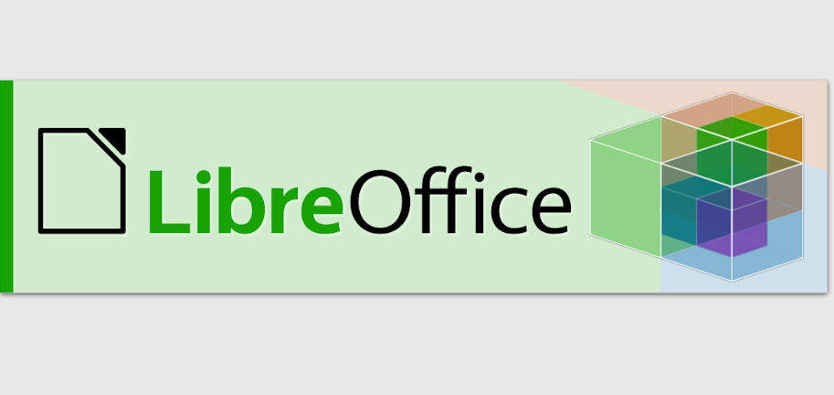
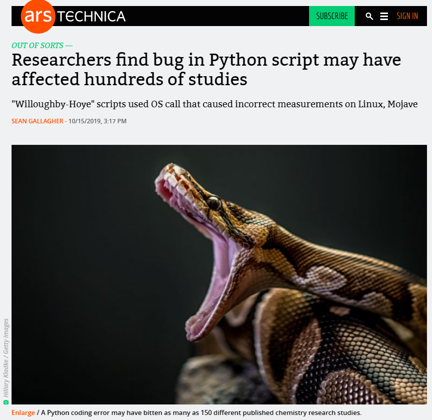
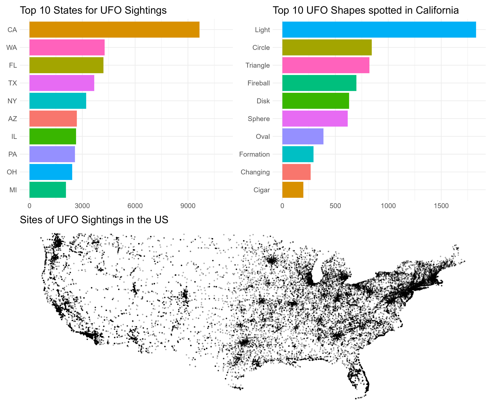

# 开源软件和R语言 

## 开源软件 {.unnumbered}

### 概述 {.unnumbered}

如果您想进行开放且可重复的研究，您应该在工作流程中使用开源软件。使用专有软件进行的研究不能轻易被其他人复制。

开源软件是被许可可以自由修改、重新混合和改进的软件。它通常是免费使用的，并以开放交流、协作参与、快速原型制作、透明度、精英管理和面向社区的开发等原则为中心。开源运动始于 20 世纪 80 年代初，部分原因是[打印机](https://medium.com/@amogh/the-story-of-open-source-so-far-bfcb685d85a4)的出现，并在该十年以[Richard Stallman](https://en.wikipedia.org/wiki/Richard_Stallman)建立的[自由软件基金会](https://en.wikipedia.org/wiki/Free_Software_Foundation)的形式进一步发展。20 世纪 90 年代末，[开源倡议](https://opensource.org/)发起，旨在提高人们对开源软件的认识和采用，并在开源实践社区之间架起桥梁。

开源软件由许多人制作，并在符合 OSD 的许可证下分发，该许可证授予以修改和未修改的形式使用、研究、更改和共享该软件的所有权利。软件自由对于实现开源软件的社区开发至关重要。

有大量可用的开源软件 - 您会发现其中一些不仅在本单元的背景下有用，而且在您如何学习以及如何进行研究的背景下也很有用。

[这里是一个有趣的 CNBC 视频（Youtube平台）](https://youtu.be/SpeDK1TPbew)，讨论了开源软件的兴起 - 它最后提到需要以开放的方式合作应对环境、癌症和阿尔茨海默病等全球挑战。

### 统计与科学计算 {.unnumbered}

#### R 与 RStudio Desktop {.unnumbered}

不言而喻，R 和 RStudio Desktop 是与本课程相关的开源软件的两个最明显的示例。就用于数据分析和统计建模的其他开源语言而言，您可能还对 Python 和 Julia 感兴趣。

<center>[{width="15%"}](https://www.r-project.org)            [{width="25%"}](https://www.r-project.org)</center>

#### Python {.unnumbered}

虽然 R 往往是对数据整理、数据可视化和统计建模感兴趣的人的首选语言，但从更通用的意义上来说，Python 可以说是"更好"的语言。Python 被机器学习社区广泛使用（仅举例）。

<center>[{width="25%"}](https://www.python.org)</center>

#### Octave {.unnumbered}

您可能听说过甚至使用过 MATLAB 进行数值计算。有一个开源的等效项，称为GNU Octave，您可能有兴趣查看一下。

<center>[{width="25%"}](https://www.gnu.org/software/octave/)</center>

#### 文档创建 {.unnumbered}

到目前为止，您可能主要使用 Microsoft Word 来编写文档。[LibreOffice](https://www.libreoffice.org/)是一个与 Microsoft Office 套件相当的优秀开源软件，提供了大量用于文档编写、处理电子表格和创建演示文稿的应用程序。

<center>[{width="25%"}](https://www.libreoffice.org/)</center>

如果您有兴趣使用[Markdown](https://www.markdownguide.org/)进行写作（这确实很容易掌握），您可能会对使用[HackMD](https://opensource.com/article/19/7/enable-collaboration-hackmd)感兴趣。HackMD 是一款 Markdown 编辑器，可让您与他人一起编写协作文档和演示文稿。

<center>[{width="25%"}](https://opensource.com/article/19/7/enable-collaboration-hackmd)</center>

#### 构建实验 {.unnumbered}

[PsychoPy](https://www.psychopy.org/)提供了一个出色的开源解决方案来构建收集人类数据的实验，并且通过配套托管网站[Pavlovia](https://pavlovia.org/)提供了一种易于使用的方法来在线运行 PsychoPy 实验。PsychoPy 已经存在很多年了，并且有许多预先构建的实验模板，您可以根据需要进行调整。[这里](https://link.springer.com/article/10.3758/s13428-018-01193-y)有一个很好的参考资料描述了 PsychoPy 环境。

<center>[{width="25%"}](https://www.psychopy.org)            [{width="25%"}](https://pavlovia.org)</center>

#### Linux {.unnumbered}

Linux 操作系统是使用最广泛的开源软件之一。您可以选择使用[Linux](https://www.linux.org/)来运行计算机，而不是在 Windows 或 Mac OS 上运行计算机。Linux 运行着世界上大多数互联网服务器，并且在学术环境中变得越来越流行。Linux 指的是一堆开源的类 Unix 操作系统。它由[Linus Torvalds](https://en.wikipedia.org/wiki/Linus_Torvalds)于 1991 年开发并发布。

<center>[{width="25%"}](https://www.linux.org/)</center>

一些最流行的 Linux 发行版是[Ubuntu](https://ubuntu.com/)（我目前使用的[^02-opensourceandr-1]）、[Fedora](https://getfedora.org/en/workstation/download/)和[Debian](https://www.debian.org/)。如果您真的想进入计算方面的研究，那么探索 Linux 的世界就很重要。

[^02-opensourceandr-1]: 笔者注：这里指原文的作者Prof. Andrew Stewart。可以看得出他确实是一名开源软件的爱好者，当在课上谈起Linux时，他讲了许多并十分推荐我们尝试Linux，并且眼睛似乎都在放光

<center>[{width="20%"}](https://ubuntu.com)[{width="25%"}]((https://getfedora.org/en/workstation/download/))[{width="15%"}](https://www.debian.org)</center>

#### 更多开源软件 {.unnumbered}

如果您对开源软件的其他示例感兴趣，您可能有兴趣查看[Tech Radar](https://www.techradar.com/uk/best/best-open-source-software) 网站上的开源替代品列表。

<center>[{width="75%"}](https://www.techradar.com/uk/best/best-open-source-software)</center>

## 开始使用 R 和 RStudio Desktop {.unnumbered}

在下面的内容中，将向介绍R语言和RStudio Desktop，这是一种集成开发环境 (IDE)，您将使用它来编写可重复的代码，涉及数据的整理、可视化、摘要和统计建模。R 和 RStudio Desktop 都是开源软件的示例。开源是进行可重复研究的关键，因为开源软件是免费的并向所有人开放。

在下面的内容中，将介绍 R 并讨论在我们的研究分析工作流程中采用此类工具的重要性。

### 为什么是R？ {.unnumbered}

-   R语言允许您进行可重复的研究和构建可重复的工作流程。R的统计包反映了统计学和数据科学领域的最新进展。

-   R中有很多令人惊叹的数据可视化包。

-   在许多机构中，下一代学者（硕士和博士学生、博士后等）正在他们的培训中学习R语言技能。

-   R编程技能在工业界、ONS、NHS、公务员[^02-opensourceandr-2]等领域非常受欢迎。

[^02-opensourceandr-2]: 笔者注：这里指英国公务员

### 开源软件 {.unnumbered}

-   [开源软件](https://opensource.org/history)是免费的，由社区（包括您在内！）建立、维护、修改和改进的——查看其许可证以获取完整详情。

-   您可以自由使用开源软件，因此不再被需要付费的专有软件（例如SPSS）所束缚。

-   开源软件得到了大型公司的支持——例如，Linux得到了包括谷歌、微软、英特尔、三星等在内的Linux基金会的支持。在过去几十年中，开源在公共和私营部门广泛使用，并对计算产生了巨大影响。

### 选择合适的软件做合适的工作 {.unnumbered}

如果您希望您的研究开放且可重复，不应使用专有（封闭）软件，如Excel、SPSS、GraphPad、MATLAB等。更好的选择是使用开源软件，如R、Octave、Python、Julia等。

您需要使整个分析流程可重复——从数据导入、数据整理、可视化、统计建模到报告生成。编写代码！

当您想与其他地方或另一个实验室（拥有不同基础设施）的同事共享研究流程分析时会发生什么？

**"在我的机器上有效！"**——但如果在您的合作者的机器上（或您的新机器上）不起作用，那就不好了。

### 开源与闭源软件 {.unnumbered}

开源软件使您的数据处理、整理、可视化建模等过程具有透明性和可重复性。

它允许其他人发现并纠正错误...

<center>[{width="75%"}](https://arstechnica.com/information-technology/2019/10/chemists-discover-cross-platform-python-scripts-not-so-cross-platform/)</center>

同时，闭源软件可能有一些风险：

<center>{width="75%"} {width="75%"}</center>

### R vs. SPSS {.unnumbered}

下面这段话风趣地对比了R与SPSS

> "SPSS就像一辆公交车——对标准事物来说使用起来很容易，但如果你想做一些没有预先编程的事情，就会非常沮丧。

> R就像一辆带着自行车在后面，皮划艇在顶上，好的步行和跑鞋在副驾驶座位上，以及山地攀登和洞穴探险装备在后备箱的四轮驱动越野车。

> 如果你愿意花时间学习如何使用这些设备，R可以带你去任何你想去的地方，但这需要的时间会比学习SPSS的公交站点要长。"

Greg Snow, 2010, stackoverflow.com

```{r RSPSSMeme, echo=FALSE, fig.align="center",  message=FALSE, warning=FALSE,out.width='75%'}
knitr::include_graphics("Pictures/RSPSSMeme.png")
```

### 关于R的书籍{-}

[***《R for Data Science》***](http://r4ds.had.co.nz) 这本书还有[第二版](https://r4ds.hadley.nz/)，但是目前官方尚未翻译为中文。值得注意的是，该书的中文翻译版由国内出版商发行，并未开源获取。

[***《Advanced R》***](https://adv-r.hadley.nz/)

### Hadley Wickham{-}

“彻底变革了R语言的人”

RStudio的首席科学家，关键R包的（主要）作者，包括ggplot2、tidyr、dplyr——这些都是tidyverse的组成部分。

```{r Hadley Wickham, echo=FALSE, fig.align="center",  message=FALSE, warning=FALSE,out.width='75%'}

```

### R语言被许多机构广泛使用{-}

可以查看[这个例子](https://medium.com/bbc-visual-and-data-journalism/how-the-bbc-visual-and-data-journalism-team-works-with-graphics-in-r-ed0b35693535)，这个例子描述了BBC的数据新闻团队是如何使用R语言进行绘图的。大家亦可作为参考。

### 做好准备！上手编写代码！

做好准备，我们即将开始编写代码。不用担心，学习R是一趟旅途，总会有起伏，但是我们会从不同的角度帮助你思考问题从而将一个个大问题分解为更小的问题，使你可以独立解决他们。如果你之前从未接触过编程语言或者撰写过任何代码，也无需担心。本课程所讲述的所有内容均提前假设参加者没有任何的编码经验。

```{r codingmeme01, echo=FALSE, fig.align="center",  message=FALSE, warning=FALSE,out.width='75%'}
knitr::include_graphics("Pictures/codingmeme01.png")
```

同样的，在编写代码时，我们会经历不同的困难，并且很可能一直在下面两种状态中转换，这是正常的请不用担心，随着练习的增多，你会逐渐趋于熟练并迎接新的挑战。

```{r codingmeme02, echo=FALSE, fig.align="center",  message=FALSE, warning=FALSE,out.width='75%'}
knitr::include_graphics("Pictures/codingmeme02.png")
```

[这里](https://rstudio.com/resources/rstudioconf-2020/open-source-software-for-data-science/)是 RStudio（和其他组织）的企业家兼创始人 JJ Allaire 的精彩演讲视频。该视频来自 rstudio::conf 2020，其中 JJ 讲述了他从成为一名政治科学家的历程、他如何参与 R 以及开源在可复制数据科学背景下的重要性。如果感兴趣，您可能想观看 RStudio 网站上的其他一些视频。

## 入门{-}

接下来将展示如何安装 R（语言）和 RStudio Desktop（用于使用该语言的 IDE）。您可以从[此处](https://www.stats.bris.ac.uk/R/)下载适用于各种平台的 R，包括 Mac OS、Windows 和 Ubuntu。要下载免费的 RStudio Desktop，只需转到[此处](https://rstudio.com/products/rstudio/download/)。

如果您遇到了网络访问问题，也可以通过这个飞书链接下载我们预下载的[Windows版本的R]()和[MacOs版本的R]()，以及[Windows版本的RStudio Desktop]()和[MacOs版本的RStudio Desktop]()。

如果您使用的是 Chromebook，或拥有平板电脑，或者在计算机上安装 R 和 RStudio Desktop 时遇到困难，则可以使用[RStudio Cloud](https://rstudio.cloud/)在浏览器中运行 RStudio 环境。您需要注册，有一个免费计划可供您每月使用 RStudio Cloud 15 小时。**不过我们强烈建议您在本地安装R与RStudio Desktop**。

<center>
<iframe src="//player.bilibili.com/player.html?aid=409752958&bvid=BV13G411a7Ba&cid=1369827721&p=1&autoplay=0" allowfullscreen="allowfullscreen" width="100%" height="500" scrolling="no" frameborder="0" sandbox="allow-top-navigation allow-same-origin allow-forms allow-scripts"> </iframe> 
</center>


<center>
<iframe src="//player.bilibili.com/player.html?aid=664017349&bvid=BV19a4y1d7fq&cid=1349316930&p=1&autoplay=0" allowfullscreen="allowfullscreen" width="100%" height="500" scrolling="no" frameborder="0" sandbox="allow-top-navigation allow-same-origin allow-forms allow-scripts"> </iframe> 
</center>


### 好的编码风格 {-}

在下面的视频中，将讨论良好的编码风格。当您编写分析脚本时，确保您的代码能够被其他人和未来的您理解是很重要的。如果您尽早养成良好的编码风格的习惯，从长远来看，这将使事情变得更加容易 - 并且您会发现协作工作更容易，因为其他人会发现与您合作更容易。

<center>
<iframe src="//player.bilibili.com/player.html?aid=749820373&bvid=BV16C4y1u7NM&cid=1369827582&p=1&autoplay=0" allowfullscreen="allowfullscreen" width="100%" height="500" scrolling="no" frameborder="0" sandbox="allow-top-navigation allow-same-origin allow-forms allow-scripts"> </iframe> 
</center>


[您可以在此处查看](https://style.tidyverse.org/)有用的 Tidyverse 风格指南。

如果您想让您的代码和数据开放（您确实应该这样做，除非有充分的理由不这样做），那么正确许可它以允许其他人（重新）使用和重新混合它非常重要。对于我自己的工作，我倾向于使用尽可能宽松的许可证。我的“首选”许可证是[MIT许可证](https://opensource.org/licenses/MIT)和[知识共享许可证 CC-BY 4.0](https://creativecommons.org/licenses/by/4.0/)。

如果您需要帮助为自己的作品选择正确的许可证，您可以使用这个[方便的指南](https://choosealicense.com/)。

## 开始你的第一个脚本{-}

您现在将运行您的第一个 R 脚本。我们将使用多年来超过 80,000 次 UFO 目击事件的数据库创建美国 UFO 目击事件的三种可视化效果。在运行代码之前，您需要在计算机上安装两个软件包 - 它们是tidyverse和patchwork。

<center>
<iframe src="//player.bilibili.com/player.html?aid=324845913&bvid=BV1Yw411x7iG&cid=1369827565&p=1&autoplay=0" allowfullscreen="allowfullscreen" width="100%" height="500" scrolling="no" frameborder="0" sandbox="allow-top-navigation allow-same-origin allow-forms allow-scripts"> </iframe> 
</center>


安装软件包后，将以下代码键入新的 R 脚本中。脚本中的数据集可以在[这个链接](https://cyouthchange.feishu.cn/file/UqWdb3XsXoKQ8dxLESScbFvlnu6?from=from_copylink)中下载。按照视频中向展示的相同方式运行代码。您的可视化看起来和我的一样嘛？

```{r YourFirstRScript, eval=FALSE, message=FALSE, warning=FALSE}
library(tidyverse) # 加载 tidyverse 包
library(patchwork) # 使用这个包将图拼接在一起

# 读取数据，在这里，我将数据存储在了Datasets文件夹下。 
ufo_sightings <- read_csv("Datasets/ufo_sightings.csv")

# 作图：美国前 10 个州的目击事件数量
plot1 <- ufo_sightings %>%
  filter(!is.na(state)) %>%
  mutate(state = str_to_upper(state)) %>%
  group_by(state) %>%
  tally() %>%
  top_n(10) %>%
  ggplot(aes(x = reorder(state, n), y = n, fill = state)) +
  geom_col() + 
  coord_flip() +
  guides(fill = "none") + 
  labs(title = "Top 10 States for UFO Sightings",
       x = NULL, 
       y = NULL) +
  ylim(0, 11000) +
  theme_minimal() +
  theme(text = element_text(size = 15))

# 计算出纬度和经度范围内的州（即排除阿拉斯加）
tidied_ufo <- ufo_sightings %>%
  filter(country == "us") %>%
  filter(latitude > 24 & latitude < 50)

# 在美国地图上绘制所有目击事件
plot2 <- tidied_ufo %>%
  ggplot(aes(x = longitude, y = latitude)) + 
  geom_point(size = .5, alpha = .25) +
  theme_void() +
  coord_cartesian() +
  labs(title = "Sites of UFO Sightings in the US") +
  theme(text = element_text(size = 15))

# 作图：加利福尼亚州发现的十大 UFO 形状图
plot3 <- tidied_ufo %>%
  filter(state == "ca") %>%
  filter(ufo_shape != "other") %>%
  filter(ufo_shape != "unknown") %>%
  group_by(ufo_shape) %>%
  tally() %>%
  top_n(10) %>%
  mutate(ufo_shape = str_to_title(ufo_shape)) %>%
  ggplot(aes(x = reorder(ufo_shape, n), y = n, fill = ufo_shape)) +
  geom_col() + 
  coord_flip() +
  guides(fill = "none") + 
  labs(title = "Top 10 UFO Shapes spotted in California",
       x = NULL, 
       y = NULL) +
  theme_minimal() +
  theme(text = element_text(size = 15))

# 将图拼接在一起
my_plot <- (plot1 + plot3) / (plot2)

ggsave("ufo_plot.jpg", plot = my_plot, width = 12, height = 10)
```

<center>
[]{width=100%}
</center>


## 帮助我们改进本节课程 {.unnumbered}

*此处应插入文本和反馈二维码或问卷链接*
